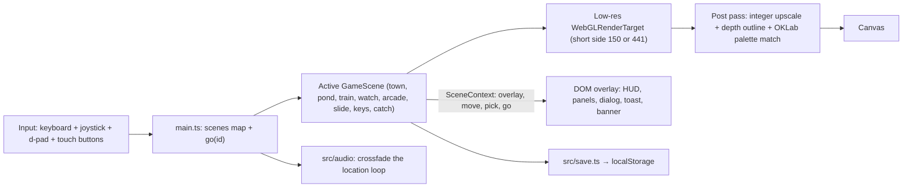

# SDD: Architecture baseline

## 1. Context / current architecture

The repo started empty (no git, no code). This document defines the baseline that 001 builds.

## 2. Problem and non-goals

**Problem:** a pixel-art 3D browser game needs a small, predictable structure that each new town location can plug into.

**Non-goals:** no backend, no accounts, no multiplayer, no external 3D models or textures.

## 3. Questions asked and answers

| Question | Answer |
| --- | --- |
| Which game? | A Japanese campfire-festival town; the four brainstormed ideas become walkable locations. |
| Characters? | All original. |
| Platforms? | Desktop browser and mobile browser. |

## 4. Proposed approach, pros / cons, rejected alternatives

**Approach:**

- Vite + TypeScript + vanilla `three`. A static site; `npm run build` outputs `dist/`.
- HTML overlay (`#ui`) on top of a single `<canvas>` for prompts, dialogs, HUD, and the touch joystick.
- Render flow per frame:

- Module layout:

| Path | Role |
| --- | --- |
| `src/main.ts` | Boot, game loop, `scenes` map, `go(id)` with fade, `SceneContext` (incl. ground-plane `pick`) |
| `src/render/pixelPipeline.ts` | Low-res colour + depth target, post shader (depth outline, OKLab palette match), client-to-NDC mapping. Short side is 150 or 441 |
| `src/render/pixelDetail.ts` | Saved pixel mode (`pixel.v1`). Current: short side 150, town 16 px/unit. 64: short side 441, town 47 px/unit |
| `src/render/palette.ts` | Fixed palette as sRGB output colours and precomputed OKLab match colours |
| `src/render/cameraRig.ts` | Orthographic oblique camera, 90° rotation (animated or `setQuarterTurns`), pixel snapping |
| `src/render/materials.ts` | Shared toon (optional `selfLit` emissive) / unlit glow materials |
| `src/render/keyLight.ts` | Shared directional-light direction `(-8, 20, 6)` |
| `src/input/` | Keyboard (movement, Shift sprint, `F` henshin, discrete `direction` events), joystick, two-finger twist |
| `src/world/` | Town layout (`town.ts`), props, collisions, zones, player. The player starts as a fox and can change into the human kid, with a smoke puff. Each page load frames the tree ring until a click or tap zooms in |
| `src/scenes/types.ts` | `GameScene`, `SceneId`, `SceneContext` |
| `src/scenes/koiPond.ts`, `koiPatterns.ts` | Koi pond and pattern data |
| `src/scenes/train/` | Night Market Train: pure rules (`levels.ts`), models, scene |
| `src/scenes/watch/` | Campfire Watch: data (guardians, spirits, waves, path), models, scene |
| `src/scenes/arcade/` | Arcade hall, shared `Minigame` base (countdown, 30 s timer, result), three minigames |
| `src/audio/loops.ts`, `src/audio/audio.ts` | Five generated loops (Web Audio, no files) and the six effects. Town 108, pond 96, watch 108, train 104, arcade 128. Each beat has a short tick. `go(id)` crossfades the loop for that scene |
| `src/ui/overlay.ts` | DOM overlay: per-scene HUD (`setHud`), stats, panels, dialog, toast, banner, fade, d-pad, mute button |
| `src/ui/koiSprite.ts` | Side-view pixel koi drawn into a 32×14 canvas for the collection |
| `src/save.ts` | Validated `localStorage` JSON helpers |
| `src/util/random.ts` | Seeded PRNG so layouts are stable between loads |
| `scripts/solve-train.ts` | Dev check that every train level is solvable at its `par` (`npm run solve:train`) |

- Persistence: `localStorage` only, keys `hanabi-taikai.<feature>.v1` (`koi`, `train`, `watch`, `arcade`, `audio`, `pixel`). `audio.v1` is `{ muted: boolean }`. `pixel.v1` is `{ detail: boolean }`. The town HUD button `64` / `普通` flips it and resizes every scene. Other scenes keep their fit-to-board cameras.
- Lines and particles set `depthWrite: false` so the depth outline ignores them.
- Dev only: `window.__game` exposes `{ scenes, go, step, pipeline, overlay, audio, current }`. `step(seconds)` advances the loop without `requestAnimationFrame`, which background browser tabs pause.

- Every scene implements `GameScene` (`scene`, `camera`, `update`, `resize`, `enter`, `exit`, optional `zoneId`, `onAction` / `onBack` / `onRotate` / `onDirection` / `onHenshin`). New locations are new `GameScene` modules registered in `main.ts` and reached through a town `Zone`; going back to the town places the player at the scene's `zoneId` entrance.

**Pros:** tiny dependency set, no framework overhead in the game loop, the pixel look is enforced in one place.

**Cons / risks:** hand-built geometry takes code; no physics engine (simple circle/box collisions only).

**Rejected alternatives:**

| Alternative | Why not |
| --- | --- |
| React / react-three-fiber | Extra layers for a game loop that does not need React state. |
| Phaser (2D) | The user asked for Three.js; rotation and depth need 3D. |
| `EffectComposer` | One custom pass is enough; avoids extra render targets. |

## 5. Acceptance criteria and verification

- [x] `npm run dev` serves the game; `npm run check` (`tsc --noEmit`) passes; `npm run build` outputs `dist/`.

## 6. Status history

| Date | Status | Note |
| --- | --- | --- |
| 2026-10-06 | draft | Baseline for an empty repo |
| 2026-10-06 | approved | Approved with plan |
| 2026-10-06 | implemented | Built with 001 |
| 2026-10-06 | implemented | Updated for 004 scene registry, context, saves, and the 005–007 modules |
| 2026-10-06 | implemented | Updated for 009: `src/audio`, `audio.v1`, `__game.audio` |
| 2026-10-07 | implemented | Updated for 012: `pixel.v1`, short side 150 or 441 |
| 2026-10-07 | implemented | Updated for 013: fox player, Shift run, opening wide shot |
| 2026-10-07 | implemented | Updated for 014: jungle framing, henshin smoke, visible swimming koi |
